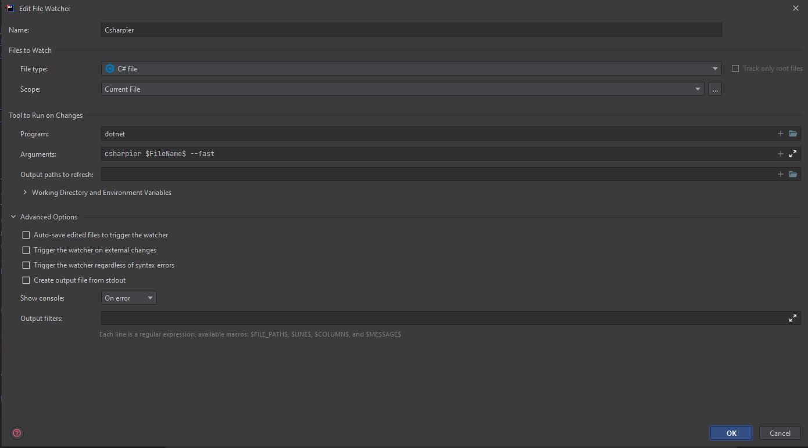

# NotWorms

## Tools

### Required

* Windows 10
* Unity 2021.3
* git
* [csharpier](https://csharpier.com/)
* [Github Actions](https://github.com/features/actions)
* [Git Hooks](https://git-scm.com/book/en/v2/Customizing-Git-Git-Hooks)

### Nice To Have

* [rider](https://www.jetbrains.com/rider/)
* [cmder](https://cmder.net/) (not strictly necessary but nice to have)

## Setup

0. Clone this repo
1. Install [Unity Hub](https://unity3d.com/get-unity/download)
   1. Install Unity 2021.3
2. Install the tools found in the manifest [here](./.config/dotnet-tools.json)
3. Run `cp Scripts/git_hooks/pre-commit .git/hooks/pre-commit`. 
   1. Since git_hooks have to be under `.git` they don't get get checked into source control, so we have to manage them in a different repo.
4. Run `git config --global core.autocrlf true`
   1. This helps with the difference between windows and unix line endings (I think)
5. Add the unity tools directory https://docs.unity3d.com/Manual/SmartMerge.html to your path. We specifically want `UnityYAMLMerge.exe` available to git

### Rider 

General installation instructions can be found here https://csharpier.com/docs/Installation. 
A custom filewatcher can be setup in Rider that makes it so csharpier is ran on save.

To do that you can
1. Go to `Settings > Tools > File Watcher`
2. Hit the plus
3. Follow my setup here 
4. Go to `Editor > General > Typing Assist` and disable `Auto-format on semicolon` and `Auto-format on closing brace`. This will help prevent rider for doing conflicting styling 
5. Go to `Tools > Actions on Save` and disable `Reformat and Cleanup code` if it's enabled.

## Best Practices

1. Make everything a prefab
2. Figure out other best practices